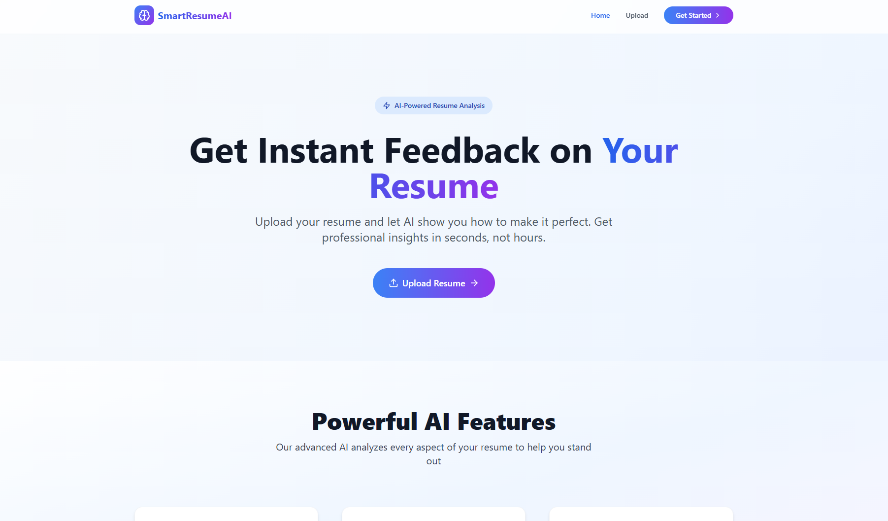
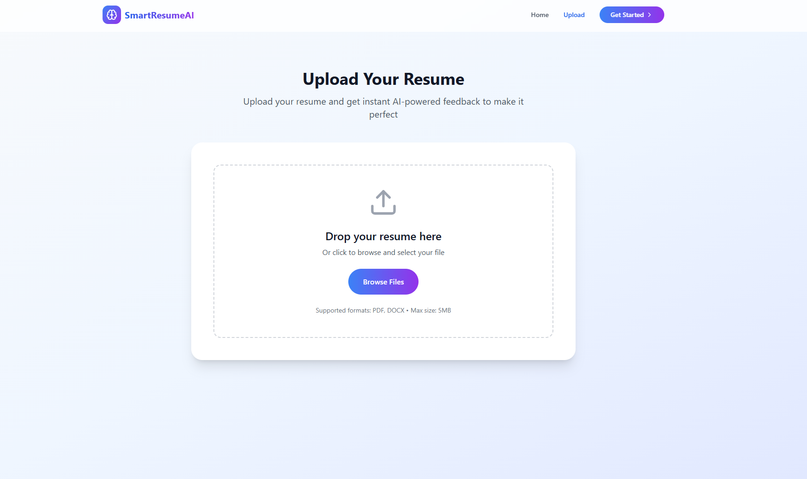
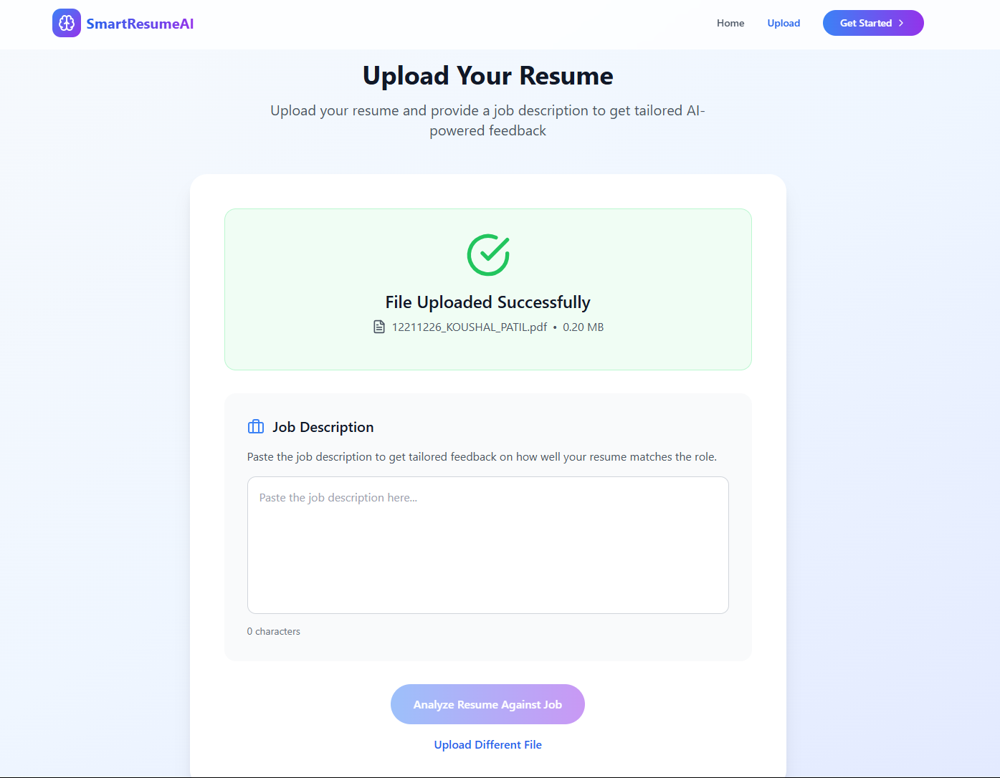
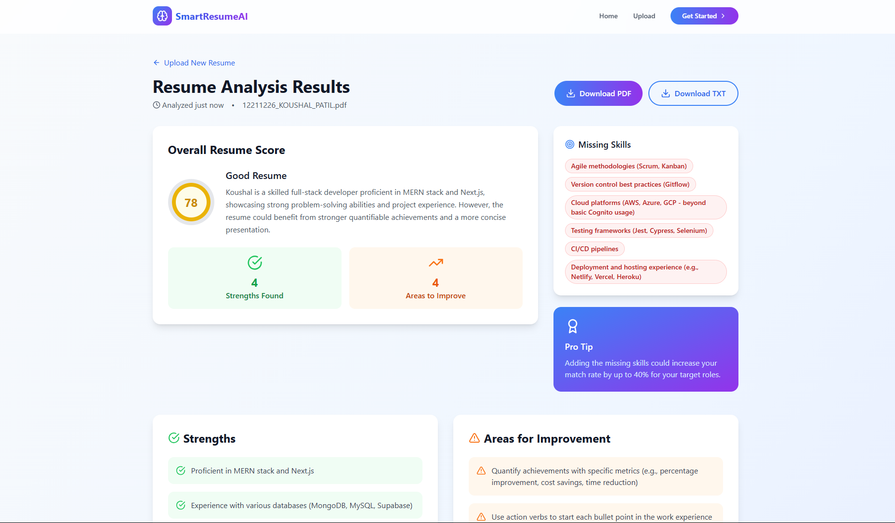

# 📄 Resume Analyzer & Feedback Generator

Welcome to the **Resume Analyzer & Feedback Generator** – an intelligent, user-friendly web application that allows users to upload their resume (PDF/DOCX) and get insightful feedback based on its content. Leveraging the power of AI and modern web technologies, this tool helps candidates enhance their resumes with targeted suggestions and analysis.

---

## 🚀 Features

✅ Upload resumes in PDF or DOCX format  
✅ **Upload a Job Description (JD)** to evaluate your resume against a specific role  
✅ Extracts text and key information from the document  
✅ Uses a Large Language Model (LLM) to analyze your resume  
✅ Provides detailed feedback including:
- Strengths of the resume  
- Areas for improvement  
- Missing key skills or sections  
- Tone, formatting, and grammar suggestions  
- **JD-based insights** – highlights perks, gaps, missing keywords, and skills based on the uploaded job description  

---

## 🖼️ Demo

  
  

---

## 🛠️ Tech Stack

**Frontend:**

- React.js / Next.js  
- Tailwind CSS or Bootstrap  
- Axios for API integration  

**Backend:**

- Node.js with Express.js  
- Multer for file uploads  
- PDF-Parse / Mammoth for text extraction  
- Integration with Gemini API / OpenAI / Google PaLM (any free LLM)  

**Others:**

- dotenv for environment config  
- fs, path modules  
- CORS & error-handling middleware  

---

## 🧠 How it Works

1. **Upload Resume & Job Description**  
   Users upload their resume in `.pdf` or `.docx` format. They can also upload or paste a job description for role-specific feedback.

2. **Text Extraction**  
   The backend extracts text content using `pdf-parse` or `mammoth`.

3. **AI Analysis**  
   The extracted text is sent to an LLM (like Gemini or OpenAI), which returns a structured analysis. If a job description is provided, it compares and evaluates resume relevance accordingly.

4. **Display Results**  
   The frontend displays the feedback in a clean, readable format with sections like:  
   - 📌 Highlights  
   - ❗ Suggestions  
   - 🚀 Opportunities to Improve  
   - 🎯 JD Match Insights

---

## 💡 Use Cases

- Job seekers wanting to optimize their resume  
- Resume review tools for placement cells  
- HR & Recruitment automation  
- Resume parsing for applicant tracking systems  
- Tailoring resumes based on specific job descriptions  

---
